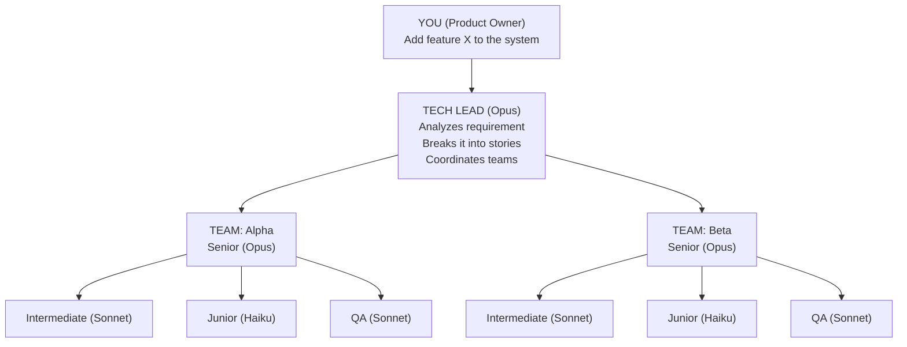
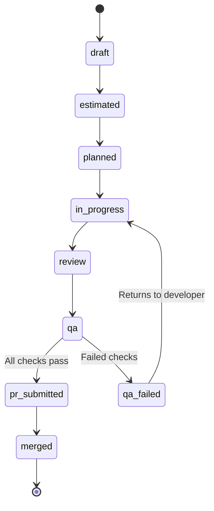
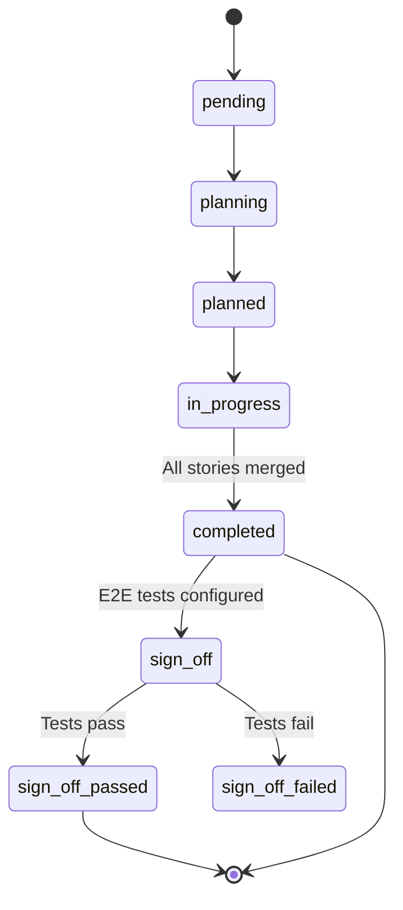
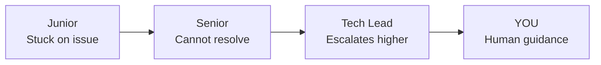

# Hive - AI Agent Orchestrator

[](https://github.com/nikrich/hungry-ghost-hive/actions/workflows/ci.yml)
[](https://www.npmjs.com/package/hungry-ghost-hive)
[](https://nodejs.org/)
[](LICENSE)
[](https://www.typescriptlang.org/)
[](https://codecov.io/gh/nikrich/hungry-ghost-hive)


Hive is a CLI tool that orchestrates AI agents modeled after agile software development teams. You act as the **Product Owner**, providing requirements. Hive's AI agents handle the rest — from planning through to merged pull requests.

## Key Features

- **AI-Powered Team Management**: Orchestrate autonomous teams of AI agents across multiple repositories
- **Agile Workflow**: Natural hierarchy mirrors real development teams with Tech Lead, Seniors, Intermediates, Juniors, and QA agents
- **Requirement to PR Automation**: From initial requirements to merged pull requests, fully automated
- **Intelligent Task Distribution**: Stories automatically routed to appropriate skill levels based on complexity scoring
- **QA Review Agents**: Dedicated QA agents auto-spawn to review PRs, run quality checks, and enforce acceptance criteria
- **Feature Sign-Off**: Automated E2E test execution when all stories for a requirement are merged
- **Real-Time Dashboard**: Interactive TUI dashboard with pipeline visualization, agent monitoring, PR review, and messaging
- **Multi-Repository Support**: Manage related services and libraries as coordinated git submodules with per-agent worktree isolation
- **Story Dependencies**: Topological dependency resolution ensures stories are completed in the right order
- **Escalation Handling**: Built-in escalation protocol when agents need guidance or hit blockers
- **PR Merge Queue**: Automated merge queue with QA gating, auto-merge, and duplicate PR detection
- **Jira Integration**: Two-way sync with Jira — epics, stories, subtasks, story points, sprint assignment, and status transitions
- **Multi-CLI Support**: Agents can use Claude Code, Codex, or Gemini CLI as their runtime
- **Distributed Mode**: Cluster support with RAFT-based leader election, peer replication, and duplicate story detection
- **Godmode**: Override complexity routing to use the most powerful models for all agents on a requirement
- **Manager Intelligence**: AI-powered stuck detection, automatic permission bypass, plan mode escape, and orphan recovery

## Installation

### Via npm (Recommended)

```bash
npm install -g hungry-ghost-hive
```

### For Contributors (Development Setup)

If you want to contribute or run from source:

```bash
# Clone the repository
git clone https://github.com/nikrich/hungry-ghost-hive.git
cd hungry-ghost-hive

# Install dependencies
npm ci

# Build the project
npm run build

# Create a symlink
npm link
```

## Quick Start

```bash
# Initialize a workspace
hive init

# Add a repository with a team
hive add-repo --url git@github.com:org/my-service.git --team my-team

# Submit a requirement (this kicks off the entire workflow)
hive req "Add user authentication with OAuth2 support"

# Watch the magic happen
hive dashboard
```

### Basic Usage Examples

After installation, you can:

```bash
# Check overall status
hive status

# View all stories
hive stories list

# Check your team's active agents
hive agents list --active

# Monitor progress in real-time
hive dashboard

# Check for escalations (agents asking for help)
hive escalations list

# Single queue for human approval requests
hive approvals list
```

## How It Works

### Your Role: Product Owner

You provide high-level requirements. The AI team handles everything else:



### The Workflow

1. **You submit a requirement** → `hive req "Your feature request"`
2. **Tech Lead analyzes** → Identifies affected repos, creates stories with dependencies
3. **Stories are estimated** → Complexity scores assigned (Fibonacci 1-13)
4. **Work is assigned** → Based on complexity:
   - Simple (1-3 points) → Junior
   - Medium (4-5 points) → Intermediate
   - Complex (6+ points) → Senior
   - Blocker stories (depended on by others) → always Senior
5. **Developers implement** → Each agent gets an isolated git worktree, writes code, runs tests
6. **PRs submitted** → Added to merge queue with automatic duplicate detection
7. **QA reviews** → QA agents auto-spawn, run lint/type-check/tests, validate acceptance criteria
8. **Auto-merged** → Approved PRs are automatically merged
9. **Feature sign-off** → When all stories are merged, E2E tests run automatically

### QA Review Agents

When a developer submits a PR to the merge queue, the manager automatically spawns a QA agent to review it:

- Checks out the PR branch and runs configurable quality checks (`npm run lint`, `npm run type-check`, etc.)
- Runs the build command and test suite
- Validates that acceptance criteria from the story are met
- Approves and auto-merges passing PRs, or rejects with detailed feedback
- After 3+ QA failures on the same story, escalates to a Senior agent

### Feature Sign-Off

When all stories for a requirement reach `merged` status:

1. The manager detects the completed requirement
2. A feature test agent is spawned to run E2E tests (configured via `e2e_test_path`)
3. Results are posted to Jira as a sign-off report
4. Requirement transitions to `sign_off_passed` or `sign_off_failed`

### The Manager (Micromanager Daemon)

The Manager ensures agents stay productive:

- **Auto-starts** when work begins
- **Configurable intervals** — fast poll for active work, slow poll when idle
- **Health checks** sync agent status with tmux sessions
- **AI-powered done detection** — uses heuristics and LLM classification to determine if agents have finished
- **Stuck detection** — monitors screen output fingerprints to identify frozen agents
- **Permission bypass** — automatically handles permission prompts that block agent progress
- **Plan mode escape** — detects agents stuck in interactive plan mode and sends escape sequences
- **Orphan recovery** — detects stories left `in_progress` by terminated agents and resets them for reassignment
- **QA spawning** — automatically creates QA agents when PRs enter the merge queue
- **Context freshness** — restarts long-running tech lead sessions to maintain fresh context
- **Nudges idle agents** to check for work
- **Forwards messages** between agents

### Story Dependencies

Stories can depend on other stories. The scheduler uses topological sorting (Kahn's algorithm) to ensure:

- Stories with unresolved dependencies are skipped during assignment
- Blocker stories (that others depend on) are routed to Senior agents for priority completion
- Circular dependencies are detected and flagged

## Commands Reference

### For You (Product Owner)

```bash
# Submit a new requirement
hive req "Implement user authentication"
hive req --file requirements.md
hive req --godmode "Critical security fix"     # Force Opus for all agents
hive req --target-branch develop "My feature"  # Target a specific branch
hive req --dry-run "Test requirement"          # Plan without spawning agents

# Import from Jira epic
hive req "https://mycompany.atlassian.net/browse/PROJ-100"

# Check overall status
hive status
hive status --json

# Open the dashboard
hive dashboard

# Dashboard controls:
#   Up/Down   Navigate agents list
#   Enter     Attach to selected agent's tmux session
#   Ctrl+B,D  Detach from tmux (returns to dashboard)
#   Tab       Switch between panels
#   Q/Ctrl+C  Exit dashboard

# View escalations (agents asking for help)
hive escalations list
hive escalations resolve <id> --message "Here's what to do..."
hive escalations acknowledge <id>

# View/handle human approval requests
hive approvals list
hive approvals approve <id> -m "Proceed"
hive approvals deny <id> -m "Do not run that"
```

### Workflow Management

```bash
# Assign stories to agents (triggers work)
hive assign
hive assign --dry-run  # Preview assignments without spawning

# View stories
hive stories list
hive stories show <story-id>

# View agents
hive agents list
hive agents list --active
hive agents inspect <agent-id>   # Detailed agent state
hive agents logs <agent-id>      # View agent event logs
hive agents cleanup              # Clean up dead agent resources

# Resume agents from saved state
hive resume --all
hive resume --agent <agent-id>

# Clean up orphaned resources (worktrees, lock files, dead sessions)
hive cleanup
```

### Merge Queue & QA

```bash
# View the merge queue
hive pr queue
hive pr queue --json

# Submit a PR to the merge queue
hive pr submit --story <story-id> --branch <branch-name>

# Sync open GitHub PRs into the merge queue
hive pr sync

# Manually trigger QA review
hive pr review --from <qa-session>

# Approve/reject PRs
hive pr approve <pr-id>
hive pr approve <pr-id> --no-merge     # Approve without auto-merging
hive pr reject <pr-id> --reason "Tests failing"

# View closed/merged PRs
hive pr closed
```

### Manager (Micromanager)

```bash
# Check manager status
hive manager status

# Manually start/stop
hive manager start
hive manager start -i 30  # Check every 30 seconds
hive manager stop

# Run single check
hive manager check

# Sync agent status with tmux
hive manager health

# Nudge a specific agent
hive manager nudge <session>
hive manager nudge hive-senior-alpha -m "Check the failing tests"
```

### Project Management Integration

```bash
# Provider-agnostic commands (works with Jira or other configured providers)
hive pm fetch HIVE-42
hive pm fetch https://mycompany.atlassian.net/browse/HIVE-42
hive pm search "project = HIVE AND status = 'In Progress'"
hive pm search "sprint in openSprints()" --max 20 --json

# Jira-specific (legacy alias, delegates to hive pm)
hive jira fetch HIVE-42
hive jira search "assignee = currentUser()"
```

### Communication

```bash
# Send message to an agent
hive msg send hive-senior-alpha "Please prioritize STORY-001"

# Check messages
hive msg inbox
hive msg inbox hive-tech-lead      # Check specific agent's inbox
hive msg read <msg-id>             # Read a specific message
hive msg reply <msg-id> "response" # Reply to a message
hive msg outbox
```

### Authentication

```bash
# Re-authenticate with providers
hive auth --provider github  # GitHub OAuth Device Flow
hive auth --provider jira    # Jira OAuth 2.0 (3LO)
```

### Configuration

```bash
# View/modify configuration
hive config show
hive config get models.senior.model
hive config set scaling.junior_max_complexity 4

# Manage teams
hive teams list
hive teams show <name>
hive teams remove <name>
```

### Cluster (Distributed Mode)

```bash
hive cluster status
hive cluster status --json
```

### Agent-Only Commands

These commands are used by agents during their work sessions:

```bash
# Story management
hive my-stories claim <story-id>
hive my-stories complete <story-id>
hive my-stories refactor --title "Simplify auth" --description "..." --points 2

# Progress reporting (posts to Jira subtask)
hive progress -m "Implemented auth middleware" --from <session>
hive progress -m "All tests passing" --from <session> --done

# Post implementation approach comment
hive approach --from <session>
```

## Architecture

### Directory Structure

```
my-workspace/
├── .hive/
│   ├── hive.db              # SQLite database (all state)
│   ├── hive.config.yaml     # Configuration
│   ├── .env                 # OAuth credentials (auto-managed)
│   ├── agents/              # Agent session states
│   └── logs/                # Conversation logs
├── repos/
│   ├── service-a/           # Git submodule (shared repo)
│   ├── team-abc-senior-1/   # Agent worktree (isolated copy)
│   ├── team-abc-junior-1/   # Agent worktree (isolated copy)
│   └── team-abc-qa-1/       # Agent worktree (isolated copy)
└── README.md
```

### Git Worktree Isolation

Each agent gets its own git worktree to prevent branch conflicts when multiple agents work on the same repository simultaneously. Worktrees are created automatically during story assignment and cleaned up when agents terminate.

### Agent Sessions

Each agent runs in a tmux session:

```
hive-tech-lead          # Tech Lead (Opus)
hive-senior-alpha       # Senior for team "alpha"
hive-intermediate-alpha-1
hive-junior-alpha-1
hive-qa-alpha           # QA for team "alpha"
hive-manager            # The micromanager daemon
```

### Agent Types

| Type         | Default Model | CLI Tool | Role                                                          |
| ------------ | ------------- | -------- | ------------------------------------------------------------- |
| Tech Lead    | Claude Opus   | claude   | Requirement analysis, story creation, cross-team coordination |
| Senior       | Claude Opus   | claude   | Complex stories (6+), estimation, team leadership, blockers   |
| Intermediate | Claude Sonnet | claude   | Medium stories (4-5), implementation and testing              |
| Junior       | Claude Haiku  | claude   | Simple stories (1-3), supervised implementation               |
| QA           | Claude Sonnet | claude   | PR review, quality checks, acceptance criteria validation     |
| Feature Test | Claude Sonnet | claude   | E2E test execution for feature sign-off                       |

### Story States



### Requirement States



## Configuration

Edit `.hive/hive.config.yaml`:

```yaml
# Model assignments (all roles configurable)
models:
  tech_lead:
    provider: anthropic
    model: claude-opus-4-20250514
    cli_tool: claude # claude | codex | gemini
    safety_mode: unsafe # safe = human approvals, unsafe = full automation
  senior:
    provider: anthropic
    model: claude-opus-4-20250514
    cli_tool: claude
    safety_mode: unsafe
  intermediate:
    provider: anthropic
    model: claude-sonnet-4-20250514
    cli_tool: claude
    safety_mode: unsafe
  junior:
    provider: anthropic
    model: claude-haiku-4-5-20251001
    cli_tool: claude
    safety_mode: unsafe
  qa:
    provider: anthropic
    model: claude-sonnet-4-20250514
    cli_tool: claude
    safety_mode: unsafe
  feature_test:
    provider: anthropic
    model: claude-sonnet-4-20250514
    cli_tool: claude
    safety_mode: unsafe

# Complexity thresholds for delegation
scaling:
  junior_max_complexity: 3 # 1-3 -> Junior
  intermediate_max_complexity: 5 # 4-5 -> Intermediate
  senior_capacity: 20 # Story points before scaling up
  refactor:
    enabled: true
    capacity_percent: 10 # Reserve up to 10% of feature capacity for refactor stories
    allow_without_feature_work: true

# QA configuration
qa:
  quality_checks:
    - npm run lint
    - npm run type-check
  build_command: npm run build
  test_command: npm test
  scaling:
    pending_per_agent: 2.5 # PRs per QA agent before scaling
    max_agents: 5 # Maximum concurrent QA agents

# Manager daemon tuning
manager:
  stuck_threshold: 300000 # 5 min before stuck detection
  nudge_cooldown: 600000 # 10 min between nudges
  max_stuck_nudges_per_story: 1
  screen_static_inactivity_threshold: 600000

# Merge queue
merge_queue:
  max_age_hours: 1 # Stale PR threshold

# E2E testing for feature sign-off
e2e_test_path: tests/e2e # Optional: enables feature sign-off

# Optional distributed mode (HTTP + peer replication)
cluster:
  enabled: false
  node_id: node-a
  listen_host: 127.0.0.1
  listen_port: 8787
  public_url: http://203.0.113.10:8787
  # auth_token: replace-with-strong-shared-secret
  peers:
    - id: node-b
      url: http://198.51.100.20:8787
  heartbeat_interval_ms: 2000
  election_timeout_min_ms: 3000
  election_timeout_max_ms: 6000
  sync_interval_ms: 5000
  story_similarity_threshold: 0.92
```

### Jira Integration

When you select Jira during `hive init`, the setup wizard will:

1. **Authenticate** via OAuth 2.0 (3LO) — you'll need a Jira OAuth app from the [Atlassian Developer Console](https://developer.atlassian.com/console/myapps/)
2. **Select your project** from available Jira projects
3. **Map statuses** — auto-detects Jira workflow statuses and maps them to Hive statuses (draft, planned, in_progress, etc.)
4. **Select a board** — picks the board used for sprint operations
5. **Detect story points field** — auto-detects the correct custom field for story points (varies between classic and next-gen projects)

#### Setting up your Atlassian OAuth app

Before running `hive init`, you must configure an OAuth 2.0 (3LO) app in the Atlassian Developer Console:

1. Go to [developer.atlassian.com/console/myapps](https://developer.atlassian.com/console/myapps/) and create a new app
2. Under **Authorization** → **OAuth 2.0 (3LO)**, add the following callback URL:
   ```
   http://127.0.0.1:9876/callback
   ```
   > **Important:** Use `127.0.0.1` — not `localhost`. Hive constructs the redirect URI with `127.0.0.1` explicitly, and Atlassian validates it character-for-character.
3. Under **Permissions**, add the following scopes:

   | API | Scopes |
   |-----|--------|
   | Jira API | `read:jira-work`, `write:jira-work`, `read:jira-user` |
   | Jira Software API | `read:board-scope:jira-software`, `write:board-scope:jira-software`, `read:sprint:jira-software`, `write:sprint:jira-software` |
   | Confluence API | `read:confluence-content.all` |
   | User Identity API | `offline_access` |

4. Save your changes, then copy the **Client ID** and **Client Secret** from the app's settings page — the `hive init` wizard will prompt you for these

> **Prerequisite:** Your Atlassian account must have an active Jira Cloud site. If you don't have one, create a free site at [atlassian.com](https://www.atlassian.com) before proceeding.

Configuration is saved to `.hive/hive.config.yaml`:

```yaml
integrations:
  project_management:
    provider: jira
    jira:
      project_key: HIVE
      site_url: https://mycompany.atlassian.net
      board_id: '3'
      story_type: Story
      subtask_type: Subtask
      story_points_field: customfield_10016 # auto-detected
      status_mapping:
        To Do: draft
        In Progress: in_progress
        Done: merged
```

OAuth credentials are stored in `.hive/.env` (auto-refreshed):

```bash
JIRA_ACCESS_TOKEN=...
JIRA_REFRESH_TOKEN=...
JIRA_CLOUD_ID=...
JIRA_SITE_URL=...
JIRA_CLIENT_ID=...
JIRA_CLIENT_SECRET=...
```

When a requirement is synced to Jira, Hive will:

- Create or reuse a Jira Epic for the requirement
- Create Stories under the epic with descriptions and acceptance criteria
- Set story points using the detected field
- Create subtasks under stories when applicable
- Move stories into the active sprint on the configured board
- Create issue links for story dependencies
- Transition stories through statuses as agents complete work
- Post lifecycle comments (progress updates, sign-off reports)

### Distributed Mode

- Run `hive manager start` on every host in the same cluster.
- Each host runs manager/scheduler runtime, but only one node is elected leader at a time (RAFT consensus).
- Leader is the only node allowed to run orchestration decisions (`assign`, scheduler loops, tech lead spawn).
- Followers stay in sync and do not schedule work.
- State replication is logical row/event sync over HTTP (no centralized DB).
- Duplicate story detection across nodes using configurable similarity threshold.

## Escalation Protocol

When agents get stuck, they escalate:



QA agents escalate to Seniors after 3+ review failures on the same story.

Check escalations:

```bash
hive escalations list
```

Resolve with guidance:

```bash
hive escalations resolve ESC-001 --message "Use OAuth2 with PKCE flow"
```

## Tips for Product Owners

1. **Be specific in requirements** - The more detail, the better the stories
2. **Check the dashboard** - `hive dashboard` shows real-time progress
3. **Monitor escalations** - Agents will ask when they need guidance
4. **Use godmode for critical work** - `hive req --godmode` uses top-tier models across the board
5. **Import from Jira** - Pass a Jira epic URL to `hive req` to import directly
6. **Trust the process** - Let agents work, they'll handle the details

## Troubleshooting

### Agents seem stuck

```bash
hive manager check   # Nudge all agents
hive manager health  # Sync status with tmux
```

### Agent session died

```bash
hive manager health  # Cleans up dead agents, respawns as needed
```

### Orphaned resources (stale worktrees, lock files)

```bash
hive cleanup         # Cleans up worktrees, lock files, dead sessions, orphaned stories
```

### View agent logs

```bash
tmux attach -t hive-senior-alpha  # Attach to see what agent is doing
# Detach with Ctrl+B, D
```

### Resume interrupted agents

```bash
hive resume --all           # Resume all agents from saved state
hive resume --agent <id>    # Resume a specific agent
```

### Reset everything

```bash
hive nuke --all  # WARNING: Deletes all data including worktrees
```

## Contributors

We appreciate contributions from everyone! This project is built and maintained by:

<!-- ALL-CONTRIBUTORS-LIST:START - Do not remove or modify this section -->
<!-- prettier-ignore-start -->
<!-- markdownlint-disable -->
<table>
  <tr>
    <td align="center"><a href="https://github.com/nikrich"><br /><sub><b>nikrich</b></sub></a><br /><a href="https://github.com/nikrich/hungry-ghost-hive/commits?author=nikrich" title="Code">💻</a> <a href="https://github.com/nikrich/hungry-ghost-hive/commits?author=nikrich" title="Documentation">📖</a> <a href="#infra-nikrich" title="Infrastructure">🚀</a> <a href="#maintenance-nikrich" title="Maintenance">🚧</a></td>
    <td align="center"><a href="https://github.com/aleeuwen73"><br /><sub><b>Alastair van Leeuwen</b></sub></a><br /><a href="https://github.com/nikrich/hungry-ghost-hive/commits?author=aleeuwen73" title="Code">💻</a></td>
  </tr>
</table>

<!-- markdownlint-restore -->
<!-- prettier-ignore-end -->

<!-- ALL-CONTRIBUTORS-LIST:END -->

## Code Quality

Hive is built with production-grade quality standards:

- **Comprehensive Testing**: 1700+ test cases with automated test execution
- **Strict TypeScript**: Full type safety with no implicit any
- **Code Linting**: ESLint configuration enforces consistent code style
- **Conventional Commits**: Commit messages follow the conventional commits specification for automatic changelog generation
- **Automated Releases**: Release Please integration for semantic versioning and automated npm publishing

## Contributing

We welcome contributions! Here's how to get started:

### Development Setup

1. **Clone and Install**:

   ```bash
   git clone https://github.com/nikrich/hungry-ghost-hive.git
   cd hungry-ghost-hive
   npm ci
   ```

2. **Run Tests**:

   ```bash
   npm test              # Run all tests
   npm run test:watch   # Watch mode
   ```

3. **Build and Lint**:
   ```bash
   npm run build         # Build the project
   npm run lint          # Check code style
   npm run type-check    # TypeScript type checking
   ```

### Pull Request Guidelines

- Create a feature branch: `git checkout -b feature/your-feature-name`
- Follow the existing code style and patterns
- Add or update tests for your changes
- Run linting and tests before committing: `npm run lint && npm test`
- Use conventional commit messages (e.g., `feat:`, `fix:`, `docs:`, `test:`, `refactor:`)
- Submit a pull request with a clear description of your changes

## Environment Variables

```bash
ANTHROPIC_API_KEY=sk-ant-...  # Required for Claude agents
OPENAI_API_KEY=sk-...         # Required if using OpenAI-based agents
GITHUB_TOKEN=ghp_...          # Required for PR creation

# Jira (auto-managed in .hive/.env after `hive init` or `hive auth jira`)
JIRA_CLIENT_ID=...            # OAuth 2.0 client ID
JIRA_CLIENT_SECRET=...        # OAuth 2.0 client secret
```

## License

This project is licensed under the **Hungry Ghost Restricted License**. See the [LICENSE](./LICENSE) file for details.

### License Summary

- You CAN use the software for any purpose, including commercial projects
- You CAN modify the software for your own use
- You CAN contribute improvements via pull requests
- You CANNOT redistribute the software to others
- You CANNOT sell or sublicense the software itself

For more information, see the full [LICENSE](./LICENSE) file.
