# Hive - AI Agent Orchestrator

[](https://github.com/nikrich/hungry-ghost-hive/actions/workflows/ci.yml)
[](https://www.npmjs.com/package/hungry-ghost-hive)
[](https://nodejs.org/)
[](LICENSE)
[](https://www.typescriptlang.org/)
[](https://codecov.io/gh/nikrich/hungry-ghost-hive)


Hive is a CLI tool that orchestrates AI agents modeled after agile software development teams. You act as the **Product Owner**, providing requirements. Hive's AI agents handle the rest—from planning through to PR submission.

## Key Features

- **AI-Powered Team Management**: Orchestrate autonomous teams of AI agents across multiple repositories
- **Agile Workflow**: Natural hierarchy mirrors real development teams with Tech Lead, Seniors, Intermediates, and Juniors
- **Requirement to PR Automation**: From initial requirements to merged pull requests, fully automated
- **Intelligent Task Distribution**: Stories automatically routed to appropriate skill levels (Junior, Intermediate, Senior)
- **Real-Time Dashboard**: Monitor team progress and agent activity with an interactive TUI dashboard
- **Multi-Repository Support**: Manage related services and libraries as coordinated git submodules
- **Escalation Handling**: Built-in escalation protocol when agents need guidance or hit blockers
- **PR Merge Queue**: Automated QA checks and merge queue management for production readiness

## Installation

### Via npm (Recommended)

```bash
npm install -g hungry-ghost-hive
```

### For Contributors (Development Setup)

If you want to contribute or run from source:

```bash
# Clone the repository
git clone https://github.com/nikrich/hungry-ghost-hive.git
cd hungry-ghost-hive

# Install dependencies
npm ci

# Build the project
npm run build

# Create a symlink
npm link
```

## Quick Start

```bash
# Initialize a workspace
hive init

# Add a repository with a team
hive add-repo --url git@github.com:org/my-service.git --team my-team

# Submit a requirement (this kicks off the entire workflow)
hive req "Add user authentication with OAuth2 support"

# Watch the magic happen
hive dashboard
```

### Basic Usage Examples

After installation, you can:

```bash
# Check overall status
hive status

# View all stories
hive stories list

# Check your team's active agents
hive agents list --active

# Monitor progress in real-time
hive dashboard

# Check for escalations (agents asking for help)
hive escalations list
```

## How It Works

### Your Role: Product Owner

You provide high-level requirements. The AI team handles everything else:

```mermaid
graph TD
    A["👤 YOU (Product Owner)<br/>Add feature X to the system"] --> B["🧠 TECH LEAD (Claude Opus)<br/>• Analyzes requirement<br/>• Breaks it into stories<br/>• Coordinates teams"]
    B --> C["👥 TEAM: Alpha<br/>Senior (Sonnet)"]
    B --> D["👥 TEAM: Beta<br/>Senior (Sonnet)"]
    C --> C1["📊 Intermediate (Haiku)"]
    C --> C2["🚀 Junior (GPT-4o-mini)"]
    C --> C3["✅ QA (Sonnet)"]
    D --> D1["📊 Intermediate (Haiku)"]
    D --> D2["🚀 Junior (GPT-4o-mini)"]
    D --> D3["✅ QA (Sonnet)"]
```



### The Workflow

1. **You submit a requirement** → `hive req "Your feature request"`
2. **Tech Lead analyzes** → Identifies affected repos, creates stories
3. **Seniors estimate** → Assign complexity scores, plan the work
4. **Work is assigned** → Based on complexity:
   - Simple (1-3 points) → Junior
   - Medium (4-5 points) → Intermediate
   - Complex (6-13 points) → Senior
5. **Developers implement** → Create branches, write code, run tests
6. **PRs submitted** → `hive pr submit` adds to merge queue
7. **QA reviews** → Automated spawning, code review, approval
8. **Merged!** → Story complete

### The Manager (Micromanager Daemon)

The Manager ensures agents stay productive:

- **Auto-starts** when work begins
- **Checks every 60 seconds** for stuck agents
- **Health checks** sync agent status with tmux sessions
- **Nudges idle agents** to check for work
- **Forwards messages** between agents
- **Spawns QA** when PRs need review

## Commands Reference

### For You (Product Owner)

```bash
# Submit a new requirement
hive req "Implement user authentication"
hive req --file requirements.md

# Check overall status
hive status

# Open the dashboard
hive dashboard

# Dashboard controls:
#   ↑↓        Navigate agents list
#   Enter     Attach to selected agent's tmux session
#   Ctrl+B,D  Detach from tmux (returns to shell)
#   Tab       Switch between panels
#   Esc/Q     Exit dashboard

# View escalations (agents asking for help)
hive escalations list
hive escalations resolve <id> --message "Here's what to do..."
```

### Workflow Management

```bash
# Assign stories to agents (triggers work)
hive assign

# View stories
hive stories list
hive stories show <story-id>

# Engineer-discovered refactor story (from an agent session)
hive my-stories refactor --session <agent-session> --title "Simplify auth middleware" --description "Duplication and branching complexity in auth stack" --points 2

# View agents
hive agents list
hive agents list --active
```

### Merge Queue & QA

```bash
# View the merge queue
hive pr queue

# Manually trigger QA review
hive pr review --from <qa-session>

# Approve/reject PRs
hive pr approve <pr-id>
hive pr reject <pr-id> --reason "Tests failing"
```

### Manager (Micromanager)

```bash
# Check manager status
hive manager status

# Manually start/stop
hive manager start
hive manager start -i 30  # Check every 30 seconds
hive manager stop

# Run single check
hive manager check

# Sync agent status with tmux
hive manager health

# Nudge a specific agent
hive manager nudge <session>
hive manager nudge hive-senior-alpha -m "Check the failing tests"
```

### Communication

```bash
# Send message to an agent
hive msg send hive-senior-alpha "Please prioritize STORY-001"

# Check messages
hive msg inbox
hive msg outbox
```

## Architecture

### Directory Structure

```
my-workspace/
├── .hive/
│   ├── hive.db              # SQLite database (all state)
│   ├── hive.config.yaml     # Configuration
│   ├── agents/              # Agent session states
│   └── logs/                # Conversation logs
├── repos/
│   ├── service-a/           # Git submodule
│   └── service-b/           # Git submodule
└── README.md
```

### Agent Sessions

Each agent runs in a tmux session:

```
hive-tech-lead          # Tech Lead (Opus)
hive-senior-alpha       # Senior for team "alpha"
hive-intermediate-alpha-1
hive-junior-alpha-1
hive-qa-alpha           # QA for team "alpha"
hive-manager            # The micromanager daemon
```

### Story States


## Configuration

Edit `.hive/hive.config.yaml`:

```yaml
# Model assignments
models:
  tech_lead:
    provider: anthropic
    model: claude-opus-4-20250514
  senior:
    provider: anthropic
    model: claude-sonnet-4-20250514
  intermediate:
    provider: anthropic
    model: claude-haiku-3-5-20241022
  junior:
    provider: openai
    model: gpt-4o-mini
  qa:
    provider: anthropic
    model: claude-sonnet-4-20250514

# Complexity thresholds for delegation
scaling:
  junior_max_complexity: 3 # 1-3 → Junior
  intermediate_max_complexity: 5 # 4-5 → Intermediate
  senior_capacity: 20 # Story points before scaling up
  refactor:
    enabled: true
    capacity_percent: 10 # Reserve up to 10% of feature capacity for refactor stories
    allow_without_feature_work: true

# QA checks
qa:
  quality_checks:
    - npm run lint
    - npm run type-check
  build_command: npm run build
  test_command: npm test
```

## Escalation Protocol

When agents get stuck, they escalate:

```mermaid
graph LR
    A["🚀 Junior<br/>Stuck on issue"] --> B["👔 Senior<br/>Cannot resolve"]
    B --> C["🧠 Tech Lead<br/>Escalates higher"]
    C --> D["👤 YOU<br/>Human guidance"]
```



Check escalations:

```bash
hive escalations list
```

Resolve with guidance:

```bash
hive escalations resolve ESC-001 --message "Use OAuth2 with PKCE flow"
```

## Tips for Product Owners

1. **Be specific in requirements** - The more detail, the better the stories
2. **Check the dashboard** - `hive dashboard` shows real-time progress
3. **Monitor escalations** - Agents will ask when they need guidance
4. **Trust the process** - Let agents work, they'll handle the details

## Troubleshooting

### Agents seem stuck

```bash
hive manager check   # Nudge all agents
hive manager health  # Sync status with tmux
```

### Agent session died

```bash
hive manager health  # Cleans up dead agents, respawns as needed
```

### View agent logs

```bash
tmux attach -t hive-senior-alpha  # Attach to see what agent is doing
# Detach with Ctrl+B, D
```

### Reset everything

```bash
hive nuke --all  # WARNING: Deletes all data
```

## Contributors

We appreciate contributions from everyone! This project is built and maintained by:

<!-- ALL-CONTRIBUTORS-LIST:START - Do not remove or modify this section -->
<!-- prettier-ignore-start -->
<!-- markdownlint-disable -->
<table>
  <tr>
    <td align="center"><a href="https://github.com/nikrich"><br /><sub><b>nikrich</b></sub></a><br /><a href="https://github.com/nikrich/hungry-ghost-hive/commits?author=nikrich" title="Code">💻</a> <a href="https://github.com/nikrich/hungry-ghost-hive/commits?author=nikrich" title="Documentation">📖</a> <a href="#infra-nikrich" title="Infrastructure">🚀</a> <a href="#maintenance-nikrich" title="Maintenance">🚧</a></td>
    <td align="center"><a href="https://github.com/aleeuwen73"><br /><sub><b>Alastair van Leeuwen</b></sub></a><br /><a href="https://github.com/nikrich/hungry-ghost-hive/commits?author=aleeuwen73" title="Code">💻</a></td>
  </tr>
</table>

<!-- markdownlint-restore -->
<!-- prettier-ignore-end -->

<!-- ALL-CONTRIBUTORS-LIST:END -->

## Code Quality

Hive is built with production-grade quality standards:

- **Comprehensive Testing**: 431+ test cases with automated test execution
- **Strict TypeScript**: Full type safety with no implicit any
- **Code Linting**: ESLint configuration enforces consistent code style
- **Conventional Commits**: Commit messages follow the conventional commits specification for automatic changelog generation
- **Automated Releases**: Release Please integration for semantic versioning and automated npm publishing

## Contributing

We welcome contributions! Here's how to get started:

### Development Setup

1. **Clone and Install**:

   ```bash
   git clone https://github.com/nikrich/hungry-ghost-hive.git
   cd hungry-ghost-hive
   npm ci
   ```

2. **Run Tests**:

   ```bash
   npm test              # Run all tests
   npm run test:watch   # Watch mode
   ```

3. **Build and Lint**:
   ```bash
   npm run build         # Build the project
   npm run lint          # Check code style
   npm run type-check    # TypeScript type checking
   ```

### Pull Request Guidelines

- Create a feature branch: `git checkout -b feature/your-feature-name`
- Follow the existing code style and patterns
- Add or update tests for your changes
- Run linting and tests before committing: `npm run lint && npm test`
- Use conventional commit messages (e.g., `feat:`, `fix:`, `docs:`, `test:`, `refactor:`)
- Submit a pull request with a clear description of your changes

## Environment Variables

```bash
ANTHROPIC_API_KEY=sk-ant-...  # Required for Claude agents
OPENAI_API_KEY=sk-...         # Required for GPT agents (juniors)
GITHUB_TOKEN=ghp_...          # Required for PR creation
```

## Issue Tracking (Beads)

This repository uses `bd` (Beads) for issue tracking. Run `bd onboard` to get started.

### Quick Reference

```bash
bd ready              # Find available work
bd show <id>          # View issue details
bd update <id> --status in_progress  # Claim work
bd close <id>         # Complete work
bd sync               # Sync with git
```

### Session Completion (Landing the Plane)

When ending a work session, complete ALL steps below. Work is NOT complete until `git push` succeeds.

1. File issues for remaining work
2. Run quality gates (tests/linters/builds) if code changed
3. Update issue status (close finished work, update in-progress)
4. Push to remote:

```bash
git pull --rebase
bd sync
git push
git status  # MUST show "up to date with origin"
```

5. Clean up (stashes, prune remote branches)
6. Verify all changes committed AND pushed
7. Hand off with context for next session

## License

This project is licensed under the **Hungry Ghost Proprietary License**. See the [LICENSE](./LICENSE) file for details.

### License Summary

- ✅ You CAN use the software for any purpose, including commercial projects
- ✅ You CAN modify the software for your own use
- ✅ You CAN contribute improvements via pull requests
- ❌ You CANNOT redistribute the software to others
- ❌ You CANNOT sell or sublicense the software itself

For more information, see the full [LICENSE](./LICENSE) file.
