# Hive: AI Agent Orchestrator Specification 

## Overview

Hive is a CLI tool that orchestrates AI agents modeled after agile software development teams. It manages multiple repositories as git submodules, with agents working autonomously through the software development lifecycle (SDLC) from requirements gathering through to PR submission.

**Core Philosophy:** Mirror real agile team dynamics where a Tech Lead coordinates multiple autonomous teams, each headed by a Senior who manages Intermediates and Juniors.

---

## Architecture

### Agent Hierarchy

```mermaid
graph TD
    H["👤 HUMAN (Head of Product)<br/>Provides initial requirements"]
    H --> TL["🧠 TECH LEAD (Claude Opus)<br/>• Single instance across all teams<br/>• Orchestrates planning phases<br/>• Manages cross-repo dependencies<br/>• Consolidates requirements into stories<br/>• Escalation endpoint for serious issues"]

    TL --> SA["TEAM: Service A"]
    TL --> SB["TEAM: Service B"]
    TL --> SC["TEAM: Service C"]

    SA --> SASnr["👔 SENIOR (Opus/Sonnet)<br/>• Team lead<br/>• Estimates<br/>• Delegates"]
    SASnr --> SAInt1["📊 INTERMEDIATE (Haiku)"]
    SASnr --> SAInt2["📊 INTERMEDIATE (Haiku)"]
    SAInt1 --> SAJr1["🚀 JUNIOR (GPT-4o-mini)"]
    SAInt2 --> SAJr2["🚀 JUNIOR (GPT-4o-mini)"]

    SB --> SBSnr["👔 SENIOR (Opus/Sonnet)<br/>• Team lead<br/>• Estimates<br/>• Delegates"]
    SBSnr --> SBInt1["📊 INTERMEDIATE (Haiku)"]
    SBSnr --> SBInt2["📊 INTERMEDIATE (Haiku)"]
    SBInt1 --> SBJr1["🚀 JUNIOR (GPT-4o-mini)"]
    SBInt2 --> SBJr2["🚀 JUNIOR (GPT-4o-mini)"]

    SC --> SCSnr["👔 SENIOR (Opus/Sonnet)<br/>• Team lead<br/>• Estimates<br/>• Delegates"]
    SCSnr --> SCInt1["📊 INTERMEDIATE (Haiku)"]
    SCSnr --> SCInt2["📊 INTERMEDIATE (Haiku)"]
    SCInt1 --> SCJr1["🚀 JUNIOR (GPT-4o-mini)"]
    SCInt2 --> SCJr2["🚀 JUNIOR (GPT-4o-mini)"]
```



### Model Configuration (Config-Driven)

```yaml
# hive.config.yaml
models:
  tech_lead:
    provider: anthropic
    model: claude-opus-4-20250514
    max_tokens: 16000
  
  senior:
    provider: anthropic
    model: claude-sonnet-4-20250514
    max_tokens: 8000
  
  intermediate:
    provider: anthropic
    model: claude-haiku-3-5-20241022
    max_tokens: 4000
  
  junior:
    provider: openai
    model: gpt-4o-mini
    max_tokens: 4000

  qa:
    provider: anthropic
    model: claude-sonnet-4-20250514
    max_tokens: 8000
```

---

## System Components

### 1. Directory Structure

```
hive-workspace/                    # Main orchestrator repo
├── .hive/
│   ├── hive.db                   # SQLite database
│   ├── hive.config.yaml          # Configuration
│   ├── agents/                   # Agent session states
│   │   ├── tech-lead.json
│   │   ├── senior-service-a.json
│   │   └── ...
│   └── logs/                     # Agent conversation logs
│       └── {agent-id}/
│           └── {timestamp}.log
├── repos/                        # Git submodules
│   ├── service-a/               
│   ├── service-b/
│   └── service-c/
└── README.md
```

### 2. SQLite Schema

```sql
-- Core tables

CREATE TABLE teams (
    id TEXT PRIMARY KEY,
    repo_url TEXT NOT NULL,
    repo_path TEXT NOT NULL,
    name TEXT NOT NULL,
    created_at TIMESTAMP DEFAULT CURRENT_TIMESTAMP
);

CREATE TABLE agents (
    id TEXT PRIMARY KEY,
    type TEXT NOT NULL CHECK (type IN ('tech_lead', 'senior', 'intermediate', 'junior', 'qa')),
    team_id TEXT REFERENCES teams(id),  -- NULL for tech_lead
    tmux_session TEXT,
    status TEXT DEFAULT 'idle' CHECK (status IN ('idle', 'working', 'blocked', 'terminated')),
    current_story_id TEXT REFERENCES stories(id),
    memory_state TEXT,  -- JSON blob for session continuity
    created_at TIMESTAMP DEFAULT CURRENT_TIMESTAMP,
    updated_at TIMESTAMP DEFAULT CURRENT_TIMESTAMP
);

CREATE TABLE requirements (
    id TEXT PRIMARY KEY,
    title TEXT NOT NULL,
    description TEXT NOT NULL,
    submitted_by TEXT DEFAULT 'human',
    status TEXT DEFAULT 'pending' CHECK (status IN ('pending', 'planning', 'planned', 'in_progress', 'completed')),
    created_at TIMESTAMP DEFAULT CURRENT_TIMESTAMP
);

CREATE TABLE stories (
    id TEXT PRIMARY KEY,
    requirement_id TEXT REFERENCES requirements(id),
    team_id TEXT REFERENCES teams(id),
    title TEXT NOT NULL,
    description TEXT NOT NULL,
    acceptance_criteria TEXT,  -- JSON array
    complexity_score INTEGER CHECK (complexity_score BETWEEN 1 AND 13),
    story_points INTEGER,
    status TEXT DEFAULT 'draft' CHECK (status IN (
        'draft',
        'estimated', 
        'planned', 
        'in_progress', 
        'review', 
        'qa', 
        'qa_failed',
        'pr_submitted', 
        'merged'
    )),
    assigned_agent_id TEXT REFERENCES agents(id),
    branch_name TEXT,
    pr_url TEXT,
    created_at TIMESTAMP DEFAULT CURRENT_TIMESTAMP,
    updated_at TIMESTAMP DEFAULT CURRENT_TIMESTAMP
);

CREATE TABLE story_dependencies (
    story_id TEXT REFERENCES stories(id),
    depends_on_story_id TEXT REFERENCES stories(id),
    PRIMARY KEY (story_id, depends_on_story_id)
);

-- Event sourcing: Immutable append-only log

CREATE TABLE agent_logs (
    id INTEGER PRIMARY KEY AUTOINCREMENT,
    agent_id TEXT NOT NULL REFERENCES agents(id),
    story_id TEXT REFERENCES stories(id),
    event_type TEXT NOT NULL,
    status TEXT,
    message TEXT,
    metadata TEXT,  -- JSON blob for additional context
    timestamp TIMESTAMP DEFAULT CURRENT_TIMESTAMP
);

CREATE INDEX idx_agent_logs_agent ON agent_logs(agent_id);
CREATE INDEX idx_agent_logs_story ON agent_logs(story_id);
CREATE INDEX idx_agent_logs_timestamp ON agent_logs(timestamp);

-- Escalations

CREATE TABLE escalations (
    id TEXT PRIMARY KEY,
    story_id TEXT REFERENCES stories(id),
    from_agent_id TEXT REFERENCES agents(id),
    to_agent_id TEXT REFERENCES agents(id),  -- NULL if escalated to human
    reason TEXT NOT NULL,
    status TEXT DEFAULT 'pending' CHECK (status IN ('pending', 'acknowledged', 'resolved')),
    resolution TEXT,
    created_at TIMESTAMP DEFAULT CURRENT_TIMESTAMP,
    resolved_at TIMESTAMP
);

-- PR tracking

CREATE TABLE pull_requests (
    id TEXT PRIMARY KEY,
    story_id TEXT REFERENCES stories(id),
    github_pr_number INTEGER,
    github_pr_url TEXT,
    status TEXT DEFAULT 'open' CHECK (status IN ('open', 'review', 'approved', 'merged', 'closed')),
    review_comments TEXT,  -- JSON array of review comments
    created_at TIMESTAMP DEFAULT CURRENT_TIMESTAMP,
    updated_at TIMESTAMP DEFAULT CURRENT_TIMESTAMP
);
```

### 3. Event Types (for agent_logs)

```
AGENT_SPAWNED
AGENT_TERMINATED
AGENT_RESUMED

REQUIREMENT_RECEIVED
PLANNING_STARTED
PLANNING_COMPLETED

STORY_CREATED
STORY_ESTIMATED
STORY_ASSIGNED
STORY_STARTED
STORY_PROGRESS_UPDATE
STORY_COMPLETED
STORY_REVIEW_REQUESTED
STORY_QA_STARTED
STORY_QA_PASSED
STORY_QA_FAILED
STORY_PR_CREATED
STORY_MERGED

CODEBASE_SWEEP_STARTED
CODEBASE_SWEEP_COMPLETED

BUILD_STARTED
BUILD_PASSED
BUILD_FAILED

CODE_QUALITY_CHECK_STARTED
CODE_QUALITY_CHECK_PASSED
CODE_QUALITY_CHECK_FAILED

ESCALATION_CREATED
ESCALATION_RESOLVED

TEAM_SCALED_UP
TEAM_SCALED_DOWN
```

---

## CLI Interface

### Installation

```bash
npm install -g @hive/orchestrator
```

### Commands

```bash
# Initialize a new Hive workspace
hive init

# Add a repository as a git submodule with team assignment
hive add-repo --url git@github.com:org/service-a.git --team payments
hive add-repo --url git@github.com:org/service-b.git --team notifications

# List all teams and repos
hive teams list

# Submit a requirement (starts the workflow)
hive req "Implement user authentication with OAuth2 support across all services"

# Or submit from a file
hive req --file requirement.md

# View status
hive status                    # Overall status
hive status --team payments    # Team-specific status
hive status --story STORY-001  # Story-specific status

# Open TUI dashboard
hive dashboard

# Agent management
hive agents list               # List all active agents
hive agents logs <agent-id>    # View agent logs
hive agents inspect <agent-id> # View agent state

# Story management
hive stories list              # List all stories
hive stories show STORY-001    # Show story details

# Escalations
hive escalations list          # List pending escalations
hive escalations resolve <id> --message "Guidance here..."

# Resume after interruption
hive resume                    # Tech lead resumes from saved state

# Configuration
hive config show
hive config set models.junior.model gpt-4o-mini
```

---

## Workflow Specification

### Phase 1: Requirement Intake

```
TRIGGER: Human runs `hive req "<requirement>"`

1. System creates requirement record in SQLite
2. Tech Lead agent is spawned (or resumed) in tmux session
3. Tech Lead logs: REQUIREMENT_RECEIVED
4. Tech Lead analyzes requirement and identifies affected repos/teams
```

### Phase 2: Planning & Estimation

```
TRIGGER: Tech Lead initiates planning

1. Tech Lead spawns ONE Senior per affected team
2. Each Senior logs: CODEBASE_SWEEP_STARTED
3. Each Senior:
   a. Scans their repo's codebase structure
   b. Identifies affected areas
   c. Produces initial complexity assessment
   d. Fleshes out detailed requirements for their domain
   e. Logs: CODEBASE_SWEEP_COMPLETED with findings

4. Tech Lead waits for all Seniors (via SQLite state polling or hooks)
5. Tech Lead consolidates findings into stories:
   a. Creates story records with status 'draft'
   b. Identifies cross-repo dependencies
   c. Logs: STORY_CREATED for each

6. Seniors estimate stories:
   a. Assign complexity_score (1-13 Fibonacci)
   b. Assign story_points
   c. Update story status to 'estimated'
   d. Log: STORY_ESTIMATED

7. Based on total story points, Seniors "hire" additional Seniors if needed:
   - Formula: 1 additional senior per 20 story points beyond initial capacity
   - Log: TEAM_SCALED_UP

8. Tech Lead finalizes plan:
   a. Updates all stories to 'planned'
   b. Logs: PLANNING_COMPLETED
```

### Phase 3: Development

```
TRIGGER: Planning complete, stories in 'planned' status

1. Tech Lead assigns stories to Seniors based on team/repo ownership
2. Senior receives story, evaluates complexity:
   
   IF complexity_score <= 3:
       Delegate to Junior
   ELSE IF complexity_score <= 5:
       Delegate to Intermediate
   ELSE:
       Senior handles directly

3. Assigned agent:
   a. Creates feature branch: feature/{story-id}-{slug}
   b. Logs: STORY_STARTED
   c. Implements the story
   d. Periodically logs: STORY_PROGRESS_UPDATE with status message
   e. Commits changes
   f. Logs: STORY_COMPLETED
   g. Updates story status to 'review'

4. On completion, story moves to review queue
```

### Phase 4: Code Review & QA

```
TRIGGER: Story status = 'review'

1. Senior reviews the code (if delegated to Junior/Intermediate)
   - If issues found: status → 'in_progress', back to developer
   - If approved: status → 'qa'

2. QA Agent picks up story:
   a. Logs: STORY_QA_STARTED
   b. Runs code quality checks (linting, static analysis)
   c. Logs: CODE_QUALITY_CHECK_PASSED or CODE_QUALITY_CHECK_FAILED
   d. Runs build
   e. Logs: BUILD_PASSED or BUILD_FAILED
   
   IF any check fails:
       - Logs: STORY_QA_FAILED
       - Status → 'qa_failed'
       - Story returns to assigned developer
   
   IF all checks pass:
       - Logs: STORY_QA_PASSED
       - Status → 'pr_submitted'
```

### Phase 5: PR Submission

```
TRIGGER: Story status = 'pr_submitted' (QA passed)

1. QA Agent (or Senior) creates GitHub PR:
   a. Target: main/master branch
   b. Title: Story title
   c. Description: Story description + acceptance criteria
   d. Links story ID in PR body

2. Creates pull_request record in SQLite
3. Logs: STORY_PR_CREATED

4. Agents can review PR and leave comments:
   a. Fetch PR diff
   b. Analyze for issues
   c. Post review comments via GitHub API
   d. Update pull_request record with comments
```

---

## Escalation Protocol

```mermaid
graph TD
    Jr["🚀 Junior<br/>Encounters unsolvable error"]
    Sr["👔 Senior<br/>Reviews issue"]
    SrResolved{Senior can<br/>resolve?}
    TL["🧠 Tech Lead<br/>Inspects & advises"]
    TLResolved{Tech Lead<br/>can resolve?}
    Human["👤 Human (Product Owner)<br/>Makes strategic decision"]

    Jr -->|"WHEN: Error unresolvable<br/>ACTION: Log escalation"| Sr
    Sr --> SrResolved
    SrResolved -->|Yes| Resolved["✅ Resolved<br/>Resume work"]
    SrResolved -->|"No after 2 attempts"| TL
    TL --> TLResolved
    TLResolved -->|Yes| Resolved
    TLResolved -->|"No<br/>(Architecture/Security/Dependency/<br/>Ambiguous requirement)"| Human
    Human -->|"Provide guidance<br/>via escalations resolve"| Resolved

    style Resolved fill:#90EE90
    style Jr fill:#FFE4B5
    style Sr fill:#87CEEB
    style TL fill:#DDA0DD
    style Human fill:#FFB6C1
```



---

## Agent Session Management

### Tmux Session Naming Convention

```
hive-tech-lead
hive-senior-{team-name}
hive-senior-{team-name}-2        # Additional seniors
hive-intermediate-{team-name}-1
hive-junior-{team-name}-1
hive-qa-{team-name}
```

### Memory Persistence

Each agent maintains a `memory_state` JSON blob in the agents table:

```json
{
  "conversation_summary": "Working on STORY-001, implemented auth middleware...",
  "current_task": {
    "story_id": "STORY-001",
    "phase": "implementation",
    "files_modified": ["src/auth/middleware.ts"],
    "last_action": "Created JWT validation function"
  },
  "context": {
    "codebase_notes": "Uses Express.js, TypeScript, Jest for testing",
    "blockers": [],
    "decisions_made": [
      "Using RS256 for JWT signing",
      "Token expiry set to 1 hour"
    ]
  },
  "checkpoint_tokens": 12500
}
```

### Resume Protocol

When an agent runs out of tokens or is interrupted:

1. Agent saves current `memory_state` to SQLite
2. Logs: `AGENT_CHECKPOINT` with current state
3. On resume (`hive resume` or automatic):
   a. New agent instance spawned
   b. Loads `memory_state` from SQLite
   c. Reads recent `agent_logs` for context
   d. Logs: `AGENT_RESUMED`
   e. Continues from checkpoint

---

## TUI Dashboard Specification

### Layout

```mermaid
graph TD
    Main["📊 HIVE ORCHESTRATOR<br/>[R]efresh [Q]uit"]

    Main --> Agents["👥 AGENTS Panel<br/>━━━━━━━━━━━━━━━<br/>ID │ Type │ Team │ Status │ Story<br/>tech-lead │ LEAD │ - │ working │ -<br/>senior-pay-1 │ SENIOR │ payments │ working │ STORY-003<br/>junior-pay-1 │ JUNIOR │ payments │ working │ STORY-007<br/>qa-payments │ QA │ payments │ idle │ -"]

    Main --> Pipeline["📈 STORY PIPELINE<br/>━━━━━━━━━━━━━━━━━<br/>PLANNED(3) │ IN PROG(2) │ REVIEW(1) │ QA(1) │ PR(0) │ MERGED(5)"]

    Main --> Activity["⏱️ RECENT ACTIVITY<br/>━━━━━━━━━━━━━━━━<br/>14:23:01 junior-pay-1 STORY_PROGRESS_UPDATE Tests passing<br/>14:22:45 senior-pay-1 STORY_ASSIGNED STORY-003<br/>14:22:30 tech-lead PLANNING_COMPLETED 12 stories<br/>14:20:15 qa-payments STORY_QA_PASSED STORY-002"]

    Main --> Escalations["⚠️ ESCALATIONS (1 pending)<br/>━━━━━━━━━━━━━━━<br/>[!] ESC-001: Unclear requirement for payment retry<br/>From: senior-pay-1 │ Story: STORY-003 │ Waiting for human"]
```



### Navigation

- Arrow keys: Navigate between panels
- Enter: Expand/view details
- Tab: Switch panels
- `/`: Filter/search
- `R`: Refresh
- `Q`: Quit

### Implementation

Use one of:
- `blessed` / `blessed-contrib` (Node.js)
- `ink` (React for CLI)
- `terminal-kit`

---

## Configuration File

```yaml
# hive.config.yaml

version: "1.0"

# Model assignments per agent tier
models:
  tech_lead:
    provider: anthropic
    model: claude-opus-4-20250514
    max_tokens: 16000
    temperature: 0.7
  
  senior:
    provider: anthropic
    model: claude-sonnet-4-20250514
    max_tokens: 8000
    temperature: 0.5
  
  intermediate:
    provider: anthropic
    model: claude-haiku-3-5-20241022
    max_tokens: 4000
    temperature: 0.3
  
  junior:
    provider: openai
    model: gpt-4o-mini
    max_tokens: 4000
    temperature: 0.2
  
  qa:
    provider: anthropic
    model: claude-sonnet-4-20250514
    max_tokens: 8000
    temperature: 0.2

# Team scaling rules
scaling:
  # Story points threshold before hiring additional senior
  senior_capacity: 20
  # Complexity threshold for delegation
  junior_max_complexity: 3
  intermediate_max_complexity: 5

# GitHub integration
github:
  # Base branch for PRs
  base_branch: main
  # PR template
  pr_template: |
    ## Story: {story_id}
    
    {description}
    
    ### Acceptance Criteria
    {acceptance_criteria}
    
    ### Changes
    {changes}

# QA configuration
qa:
  # Commands to run for quality checks
  quality_checks:
    - npm run lint
    - npm run type-check
  # Build command
  build_command: npm run build
  # Test command (optional)
  test_command: npm test

# Agent behavior
agents:
  # Polling interval for state checks (ms)
  poll_interval: 5000
  # Max retries before escalation
  max_retries: 2
  # Token threshold for checkpoint
  checkpoint_threshold: 14000

# Logging
logging:
  level: info
  # Retain logs for N days
  retention_days: 30
```

---

## API Keys & Environment

```bash
# .env (not committed)
ANTHROPIC_API_KEY=sk-ant-...
OPENAI_API_KEY=sk-...
GITHUB_TOKEN=ghp_...
```

---

## Implementation Modules

### Core Modules

```
src/
├── index.ts                 # CLI entry point
├── cli/
│   ├── commands/
│   │   ├── init.ts
│   │   ├── add-repo.ts
│   │   ├── req.ts
│   │   ├── status.ts
│   │   ├── resume.ts
│   │   ├── agents.ts
│   │   ├── stories.ts
│   │   ├── escalations.ts
│   │   └── config.ts
│   └── dashboard/
│       ├── index.ts
│       ├── panels/
│       │   ├── agents.ts
│       │   ├── pipeline.ts
│       │   ├── activity.ts
│       │   └── escalations.ts
│       └── components/
├── agents/
│   ├── base-agent.ts        # Abstract base class
│   ├── tech-lead.ts
│   ├── senior.ts
│   ├── intermediate.ts
│   ├── junior.ts
│   └── qa.ts
├── orchestrator/
│   ├── workflow.ts          # SDLC state machine
│   ├── scheduler.ts         # Story assignment logic
│   └── scaler.ts            # Team scaling logic
├── db/
│   ├── client.ts            # SQLite client
│   ├── migrations/
│   └── queries/
│       ├── agents.ts
│       ├── stories.ts
│       ├── logs.ts
│       └── escalations.ts
├── tmux/
│   ├── manager.ts           # Spawn/kill sessions
│   └── utils.ts
├── git/
│   ├── submodules.ts
│   ├── branches.ts
│   └── github.ts            # PR creation, reviews
├── llm/
│   ├── provider.ts          # Abstract LLM interface
│   ├── anthropic.ts
│   ├── openai.ts
│   └── hooks.ts             # Opus hooks implementation
├── config/
│   ├── loader.ts
│   └── schema.ts
└── utils/
    ├── logger.ts
    └── helpers.ts
```

---

## Agent Prompts (Templates)

### Tech Lead System Prompt

```markdown
You are the Tech Lead of Hive, an AI development team orchestrator. You coordinate multiple autonomous teams, each responsible for a specific service/repository.

## Your Responsibilities
1. Receive requirements from the human (Head of Product)
2. Analyze requirements and identify affected services/repos
3. Coordinate with Seniors to gather domain-specific insights
4. Consolidate findings into well-defined stories
5. Manage cross-repo dependencies
6. Handle escalations from Seniors
7. Ensure consistent progress across all teams

## Current State
{current_state_from_sqlite}

## Teams Under Your Coordination
{teams_list}

## Guidelines
- Break down requirements into atomic, testable stories
- Identify dependencies between stories across repos
- Ensure each story has clear acceptance criteria
- Monitor progress via the shared SQLite state
- Escalate to human only for: ambiguous requirements, architectural decisions, security concerns

## Communication
Update your progress by calling the `log_event` function with appropriate event types.
When waiting for Seniors, poll the database state or wait for hook signals.
```

### Senior System Prompt

```markdown
You are a Senior Developer on Team {team_name}, responsible for the {repo_name} service.

## Your Responsibilities
1. Conduct codebase analysis when requested by Tech Lead
2. Estimate story complexity and points
3. Delegate work to Intermediates and Juniors based on complexity
4. Review code from delegated work
5. Handle complex implementations directly
6. Escalate blockers to Tech Lead

## Your Codebase
Repository: {repo_path}
Tech Stack: {detected_stack}
Key Directories: {key_directories}

## Complexity Guidelines
- 1-3 points: Simple changes, delegate to Junior
- 4-5 points: Moderate changes, delegate to Intermediate
- 6-13 points: Complex changes, handle yourself or pair with Intermediate

## Current Assignment
{current_story_details}

## Guidelines
- Always create a feature branch before starting work
- Write clean, tested code following existing patterns
- Update SQLite state with progress frequently
- If stuck after 2 attempts, escalate to Tech Lead
```

### QA Agent System Prompt

```markdown
You are the QA Agent for Team {team_name}. You ensure code quality before PR submission.

## Your Responsibilities
1. Run code quality checks (linting, type checking)
2. Execute the build process
3. Verify the code meets acceptance criteria
4. Approve or reject with clear feedback

## Quality Checklist
- [ ] Code passes linting: `{lint_command}`
- [ ] Code passes type check: `{type_check_command}`
- [ ] Build succeeds: `{build_command}`
- [ ] Changes align with story acceptance criteria
- [ ] No obvious security issues
- [ ] Code follows repository patterns

## On Failure
- Mark story as 'qa_failed'
- Log specific failures with actionable feedback
- Story returns to developer for fixes

## On Success
- Mark story as ready for PR
- Prepare PR description with changes summary
```

---

## Error Handling

### Build Failures

```
1. QA logs BUILD_FAILED with error output
2. Story status → 'qa_failed'
3. Assigned developer receives failure notification via state
4. Developer analyzes error, fixes, recommits
5. Story returns to QA queue
```

### Agent Crashes

```
1. Tmux session terminates unexpectedly
2. Watchdog process detects missing session
3. Agent status → 'terminated' in SQLite
4. If story was in progress: status → 'blocked'
5. Alert logged, Senior/Tech Lead notified
6. `hive resume` can restart agent from checkpoint
```

### Token Exhaustion

```
1. Agent approaches token limit (checkpoint_threshold)
2. Agent saves memory_state to SQLite
3. Logs AGENT_CHECKPOINT
4. Agent gracefully terminates
5. New agent instance auto-spawned
6. Loads memory_state, continues
```

---

## Future Considerations (Out of Scope for v1)

- [ ] Web UI dashboard
- [ ] Slack/Discord notifications
- [ ] Multiple concurrent requirements
- [ ] Cost tracking and budgets
- [ ] Performance analytics
- [ ] Custom agent personalities
- [ ] Integration with external issue trackers (Jira)
- [ ] Parallel QA pipelines
- [ ] Automated rollback on failures

---

## Glossary

| Term | Definition |
|------|------------|
| **Hive** | The orchestrator system |
| **Requirement** | High-level feature request from human |
| **Story** | Atomic unit of work with acceptance criteria |
| **Agent** | AI instance performing a role |
| **Team** | Group of agents assigned to a repository |
| **Escalation** | Issue requiring higher-level intervention |
| **Checkpoint** | Saved agent state for continuity |
| **Hook** | Signal mechanism for agent coordination |

---

## Acceptance Criteria for MVP

1. [ ] `hive init` creates workspace with SQLite schema
2. [ ] `hive add-repo` adds git submodule and creates team
3. [ ] `hive req` spawns Tech Lead and begins planning
4. [ ] Tech Lead can spawn Seniors and coordinate planning
5. [ ] Stories are created with complexity scores
6. [ ] Seniors can delegate to Juniors based on complexity
7. [ ] Developers can implement stories and commit
8. [ ] QA runs quality checks and build
9. [ ] PRs are created on GitHub
10. [ ] TUI dashboard shows real-time status
11. [ ] Escalations flow correctly through hierarchy
12. [ ] Agents can resume from saved state
13. [ ] All events logged to SQLite immutable log